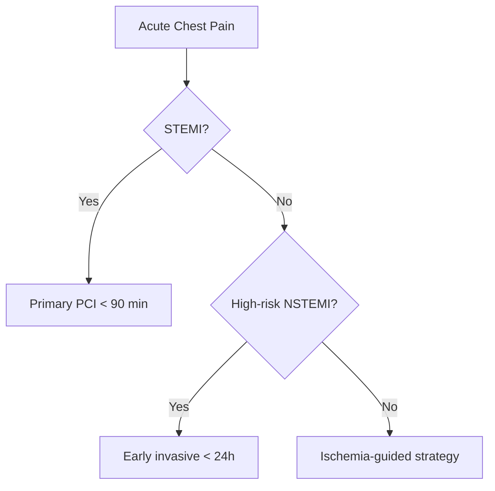
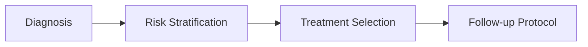
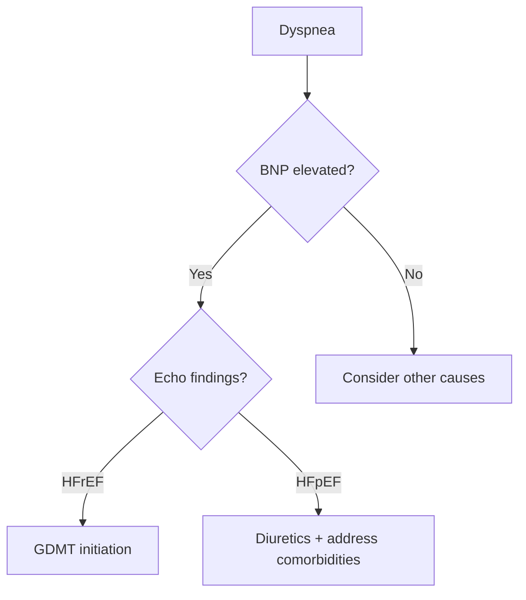
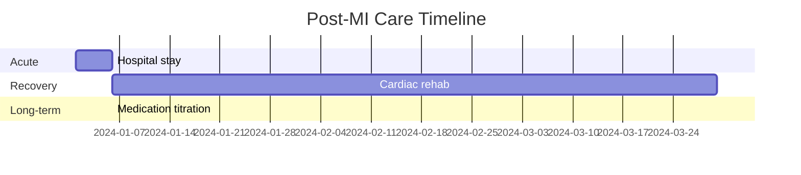
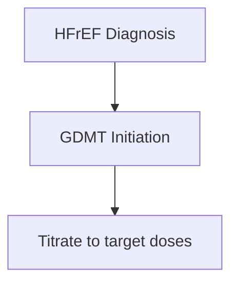

# Cardiology Visual System

A unified meta-skill that intelligently routes visual content requests to the optimal tool. No more switching between Napkin.ai, NotebookLM, or other subscriptions—everything happens in Claude Code.

## Quick Reference: What Tool Does What

| You Ask For | Tool Used | Output |
|-------------|-----------|--------|
| Blog header, lifestyle photo, patient scenario | **Fal.ai** | PNG image |
| Infographic, explainer graphic, medical illustration | **Gemini** | PNG/JPG image |
| Flowchart, treatment algorithm, clinical pathway | **Mermaid** | SVG/PNG diagram |
| Slide deck, presentation | **Marp** | PPTX/PDF/HTML slides |
| Data chart, trial results, trends over time | **Plotly** | Interactive HTML or PNG |
| Interactive explainer, dashboard | **React Artifact** | Interactive HTML |

## Automatic Routing Logic

When you ask for visuals, I determine the best tool by analyzing your request:

### → Route to Fal.ai (Stock/Human Imagery)
Keywords: `blog image`, `header`, `hero image`, `lifestyle`, `patient photo`, `stock`, `person`, `family`, `emotional`, `scenario`

**Best for:**
- Blog post headers
- Patient experience illustrations
- Lifestyle/wellness imagery
- Emotional/human-centered scenes
- Recovery and hope imagery

**NOT for:** Medical devices, ECGs, diagrams, data, or text-heavy content

### → Route to Gemini (Infographics & Medical Illustrations)
Keywords: `infographic`, `explainer`, `illustration`, `visual summary`, `concept diagram`, `icons`, `steps`, `process visual`, `simplified`, `educational graphic`

**Best for:**
- Infographics (like Napkin.ai produces)
- Medical concept illustrations
- Simplified explainer graphics
- Educational visuals with icons
- Text-in-image content
- Visual summaries of articles

### → Route to Mermaid (Diagrams & Flowcharts)
Keywords: `flowchart`, `algorithm`, `pathway`, `decision tree`, `sequence`, `timeline`, `process flow`, `treatment algorithm`, `diagnostic pathway`, `workflow`

**Best for:**
- Clinical decision trees
- Treatment algorithms
- Diagnostic pathways
- Process workflows
- Organizational charts
- Sequence diagrams
- Gantt charts for timelines

### → Route to Marp (Slide Decks)
Keywords: `slides`, `presentation`, `deck`, `powerpoint`, `lecture`, `talk`, `keynote`

**Best for:**
- Conference presentations
- Educational lectures
- Patient education slides
- Grand rounds presentations
- CME content

### → Route to Plotly (Data Visualization)
Keywords: `chart`, `graph`, `plot`, `data`, `statistics`, `trial results`, `forest plot`, `trends`, `comparison`, `survival curve`, `Kaplan-Meier`, `bar chart`, `line graph`, `scatter`

**Best for:**
- Clinical trial results
- Statistical comparisons
- Trends over time
- Forest plots
- Survival curves
- Before/after data
- Multi-study comparisons

### → Route to React Artifact (Interactive)
Keywords: `interactive`, `dashboard`, `calculator`, `tool`, `widget`, `animated`, `explorable`

**Best for:**
- Risk calculators
- Interactive explainers
- Animated diagrams
- Patient education tools
- Explorable explanations

---

## Tool 1: Fal.ai (Blog Imagery)

### Setup
```bash
export FAL_KEY="your-fal-api-key"
# Get key from: https://fal.ai/dashboard/keys
```

### Usage
```bash
python scripts/fal_image.py "A 55-year-old man experiencing chest pain at work" --output hero.png
```

### Models
| Model | Cost | Best For |
|-------|------|----------|
| `fal-ai/recraft-v3` | $0.04 | **Default** - Best quality |
| `fal-ai/flux-pro/v1.1` | $0.04 | Photorealism |
| `fal-ai/flux/schnell` | $0.003 | Fast/cheap drafts |

### What to Generate vs Not Generate

✅ **GENERATE:**
- Patient symptoms/experiences (chest pain, shortness of breath)
- Lifestyle scenes (exercise, healthy cooking)
- Doctor-patient conversations
- Family support moments
- Recovery celebrations

❌ **DO NOT GENERATE:**
- Medical devices (pacemakers, stents, valves)
- Clinical imagery (ECGs, angiograms, OR scenes)
- Anatomical diagrams
- Medications

---

## Tool 2: Gemini (Infographics)

### Setup
```bash
export GEMINI_API_KEY="your-gemini-api-key"
```

### Usage
```python
python scripts/gemini_infographic.py \
  --topic "Heart Failure Stages" \
  --style "minimalist medical" \
  --output hf_stages.jpg
```

### Prompting for Medical Infographics

**Structure your prompt:**
```
Create a [STYLE] infographic showing [TOPIC].

Include:
- [Key point 1]
- [Key point 2]
- [Key point 3]

Style: [clean/minimalist/modern medical], use icons, clear hierarchy, 
professional color palette (blues, teals for medical), easy to read text
```

**Example prompts:**

1. **Disease Progression:**
   > "Create a minimalist medical infographic showing the 4 stages of heart failure (A, B, C, D). Use icons for each stage, show progression with arrows, include brief descriptions. Clean layout, medical blue color scheme."

2. **Treatment Comparison:**
   > "Create an infographic comparing medication vs intervention for AFib. Two columns, icons for each approach, bullet points for pros/cons. Modern medical style."

3. **Risk Factor Summary:**
   > "Create a visual summary of 7 modifiable risk factors for heart disease. Icon for each factor, clean grid layout, actionable tips. Professional medical illustration style."

---

## Tool 3: Mermaid (Diagrams)

You have Mermaid Chart MCP connected. Use it for structured diagrams.

### Common Cardiology Diagram Types

**1. Treatment Algorithm:**


**2. Clinical Pathway:**


**3. Diagnostic Decision Tree:**


**4. Timeline (Gantt):**


---

## Tool 4: Marp (Slides)

### Setup
```bash
npm install -g @marp-team/marp-cli
```

### Usage

1. I write Markdown with Marp syntax
2. Save as `presentation.md`
3. Convert:
```bash
marp presentation.md --pptx           # PowerPoint
marp presentation.md --pdf            # PDF
marp presentation.md -o slides.html   # HTML
```

### Marp Template for Medical Slides

```markdown
---
marp: true
theme: default
paginate: true
backgroundColor: #ffffff
color: #333333
---

# Heart Failure Management
## Modern Approaches in 2024

Dr. [Your Name]
Interventional Cardiology

---

# Agenda

1. Current Guidelines
2. New Therapies
3. Case Discussion

---

# Key Statistics

- 6.7 million Americans with HF
- 50% mortality at 5 years
- $30.7 billion annual cost


---

# Treatment Algorithm



---

# Take-Home Points

1. Early initiation matters
2. Quadruple therapy is standard
3. Device therapy in appropriate patients

---

# Questions?

Contact: your@email.com
```

---

## Tool 5: Plotly (Data Visualization)

### Setup
```bash
pip install plotly kaleido pandas --break-system-packages
```

### Common Medical Visualizations

**1. Bar Chart (Trial Results):**
```python
import plotly.express as px

data = {
    'Treatment': ['Drug A', 'Drug B', 'Placebo'],
    'Event Rate (%)': [12.3, 15.1, 18.7]
}
fig = px.bar(data, x='Treatment', y='Event Rate (%)',
             title='Primary Endpoint: Major Cardiovascular Events',
             color='Treatment')
fig.write_html('trial_results.html')
fig.write_image('trial_results.png')
```

**2. Forest Plot Style:**
```python
import plotly.graph_objects as go

studies = ['PARADIGM-HF', 'DAPA-HF', 'EMPEROR-Reduced']
hr = [0.80, 0.74, 0.75]
lower = [0.73, 0.65, 0.65]
upper = [0.87, 0.85, 0.86]

fig = go.Figure()
for i, study in enumerate(studies):
    fig.add_trace(go.Scatter(
        x=[lower[i], upper[i]], y=[study, study],
        mode='lines', line=dict(color='gray', width=2)
    ))
    fig.add_trace(go.Scatter(
        x=[hr[i]], y=[study],
        mode='markers', marker=dict(size=12, color='navy')
    ))

fig.add_vline(x=1.0, line_dash="dash", line_color="red")
fig.update_layout(title='Hazard Ratios for Heart Failure Trials',
                  xaxis_title='Hazard Ratio (95% CI)')
```

**3. Trend Over Time:**
```python
import plotly.express as px

fig = px.line(df, x='Year', y='Mortality Rate', 
              color='Treatment Era',
              title='Heart Failure Mortality Trends 1990-2024')
fig.write_html('trends.html')
```

---

## Integrated Workflow Example

**Scenario:** You're writing a blog post about heart failure medications.

### Step 1: Hero Image (Fal.ai)
```bash
python scripts/fal_image.py \
  "Elderly patient having hopeful conversation with cardiologist about new treatment options" \
  --output images/hero.png
```

### Step 2: Treatment Algorithm (Mermaid)
```
Create a Mermaid flowchart showing HFrEF GDMT initiation:
- Start with diagnosis
- Branch to ARNI/ACEi + Beta-blocker
- Add SGLT2i + MRA
- Device consideration
```

### Step 3: Trial Data (Plotly)
```python
# Compare mortality reduction across trials
trials_df = pd.DataFrame({
    'Trial': ['PARADIGM-HF', 'DAPA-HF', 'EMPEROR-Reduced'],
    'Mortality Reduction': [20, 17, 14]
})
fig = px.bar(trials_df, x='Trial', y='Mortality Reduction',
             title='Mortality Reduction in Landmark HF Trials (%)')
```

### Step 4: Key Concepts Infographic (Gemini)
```
Create a clean medical infographic summarizing the "4 Pillars of HFrEF Therapy":
1. ARNI/ACEi - heart icon
2. Beta-blocker - heart rate icon  
3. MRA - kidney/electrolyte icon
4. SGLT2i - glucose/kidney icon

Style: modern medical, blue color scheme, minimal text, icon-focused
```

---

## API Key Checklist

Before using this system, ensure these are set:

```bash
# Fal.ai (blog images)
export FAL_KEY="your-key"

# Gemini (infographics)  
export GEMINI_API_KEY="your-key"

# Mermaid - uses MCP, no key needed
# Plotly - local, no key needed
# Marp - local, no key needed
```

---

## Cost Summary

| Tool | Cost | Typical Use |
|------|------|-------------|
| Fal.ai (Recraft) | $0.04/image | 3-4 per blog = $0.16 |
| Gemini | Free tier available | Infographics |
| Mermaid | Free (MCP) | Diagrams |
| Plotly | Free | Data viz |
| Marp | Free | Slides |

**Total per blog post: ~$0.16-0.20** (vs separate subscriptions)

---

## Files in This Skill

```
cardiology-visual-system/
├── SKILL.md                    # This file
├── scripts/
│   ├── fal_image.py           # Fal.ai image generation
│   ├── gemini_infographic.py  # Gemini infographic generation
│   ├── plotly_charts.py       # Common chart templates
│   └── convert_slides.sh      # Marp conversion helper
├── templates/
│   ├── marp_medical.md        # Medical slide template
│   └── plotly_medical.py      # Medical chart templates
└── references/
    └── prompt_examples.md     # Curated prompts for each tool
```
