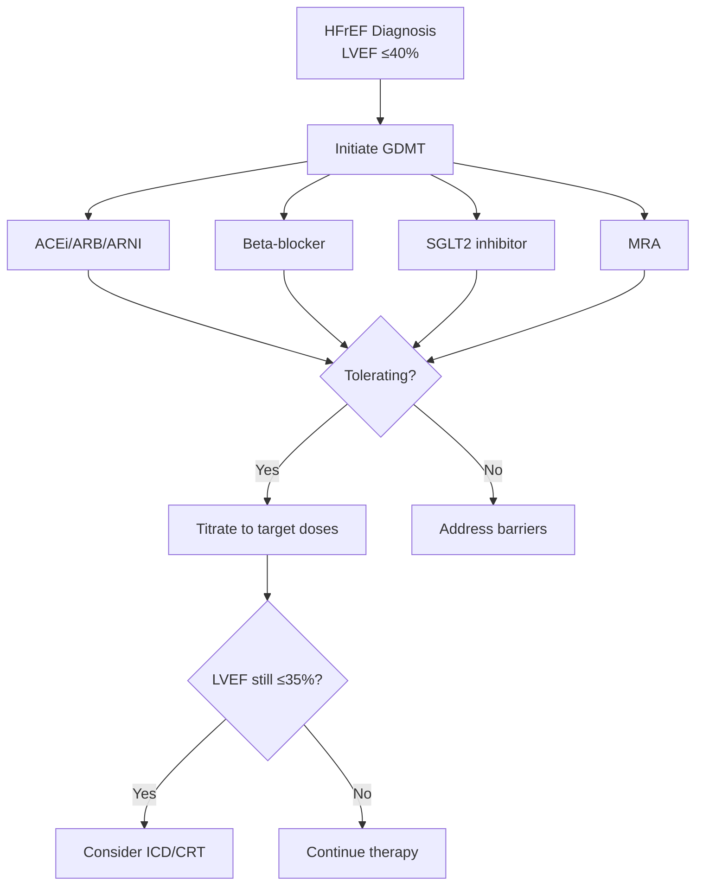
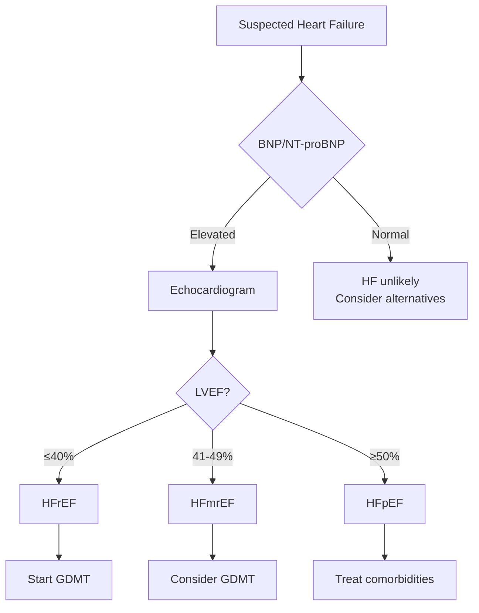
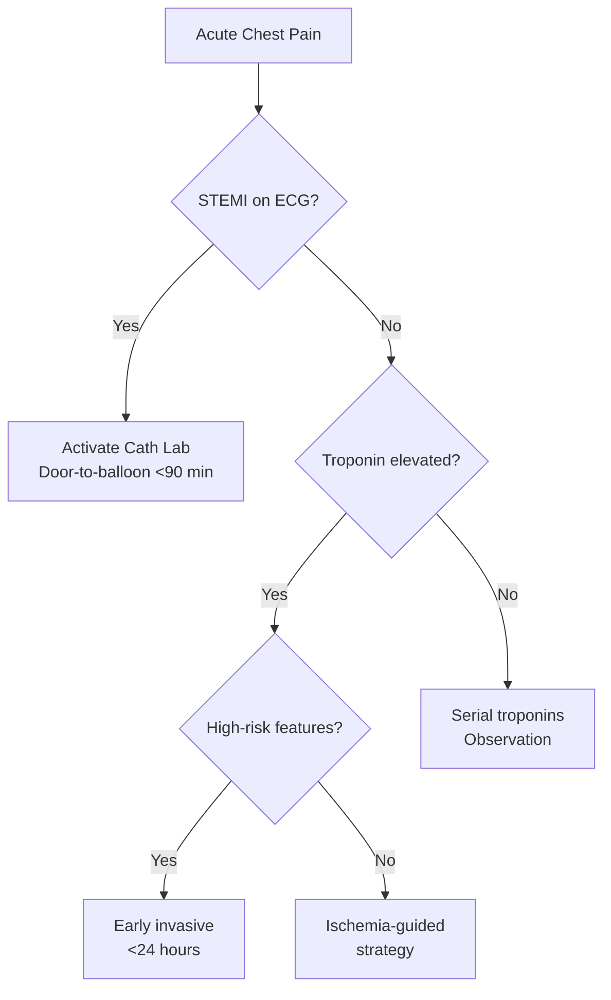
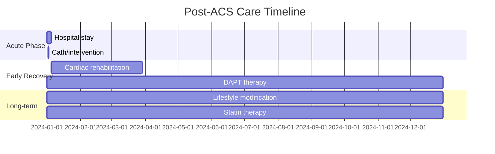
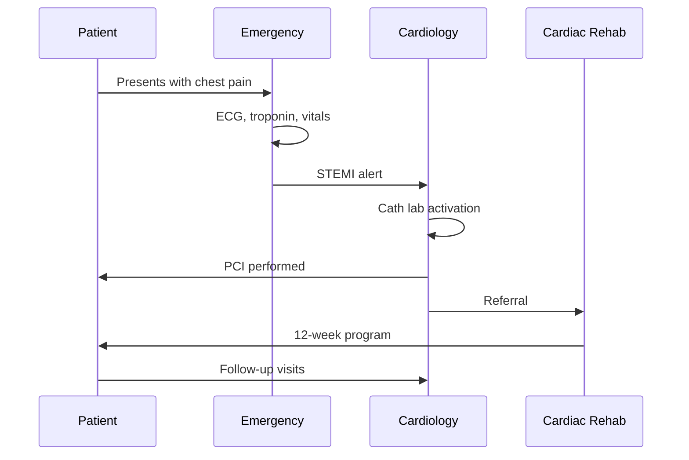

# Visual Content Prompt Examples

Quick reference for generating different types of visual content for cardiology thought leadership.

---

## Fal.ai: Blog Imagery

### Hero Images (Emotional Hook)

```
"A 55-year-old man at his office desk, suddenly clutching his chest with a worried expression, realistic photography"

"Elderly woman sitting on a park bench, looking contemplative, golden hour lighting, hopeful mood"

"Young professional woman checking her smartwatch for heart rate, modern urban setting"
```

### Patient Experience

```
"Person experiencing shortness of breath at the top of stairs, realistic home setting, empathetic portrayal"

"Middle-aged man looking fatigued after minimal exertion, seated on couch, natural lighting"

"Woman with hand on chest feeling palpitations, concerned but composed expression"
```

### Recovery & Hope

```
"Smiling patient shaking hands with cardiologist, good news moment, bright medical office"

"Grandparent playing with grandchildren in backyard, recovery celebration, warm colors"

"Person completing cardiac rehabilitation exercise, determined expression, supportive trainer"
```

### Lifestyle & Prevention

```
"Diverse group of seniors in outdoor yoga class, heart healthy lifestyle, morning light"

"Family cooking Mediterranean meal together in modern kitchen, healthy eating"

"Couple walking hand in hand on beach at sunrise, active retirement lifestyle"
```

### Medical Encounters (Human Side)

```
"Patient and doctor having compassionate conversation, medical office, trust and care"

"Family members in hospital waiting room, supporting each other, emotional but hopeful"

"Nurse holding elderly patient's hand, comfort and reassurance"
```

---

## Gemini: Infographics

### Disease Progression

```
Create a minimalist medical infographic showing the 4 stages of heart failure (A through D).

Include:
- Risk factors only (Stage A)
- Structural changes, no symptoms (Stage B)
- Symptomatic heart failure (Stage C)
- Advanced/refractory (Stage D)

Style: Clean icons, blue medical color palette, arrows showing progression, brief text labels
```

### Risk Factors

```
Create an educational infographic about 7 modifiable cardiovascular risk factors.

Include:
- Hypertension (blood pressure gauge icon)
- Diabetes (glucose icon)
- Smoking (cigarette with X icon)
- Obesity (scale icon)
- Physical inactivity (sedentary icon)
- Unhealthy diet (food icon)
- High cholesterol (blood vessel icon)

Style: Grid layout, icons with brief labels, color-coded by modifiability
```

### Treatment Comparison

```
Create an infographic comparing treatment approaches for atrial fibrillation.

Two columns:
1. Rate Control - medications, goal heart rate, when to use
2. Rhythm Control - medications, ablation, when to prefer

Style: Side-by-side layout, clean icons, medical blue/teal colors
```

### Symptom Guide

```
Create a patient-friendly infographic showing warning signs of heart attack.

Include:
- Chest pain/pressure (most common)
- Arm pain (often left)
- Jaw pain
- Shortness of breath
- Nausea
- Cold sweats
- Note: Women may have atypical symptoms

Style: Human figure outline, symptom labels pointing to areas, urgent color accents for "call 911"
```

### Statistics Summary

```
Create a data infographic about heart disease in America.

Key stats:
- #1 cause of death
- 697,000 deaths/year
- 1 in 5 deaths
- $229 billion annual cost
- 80% preventable with lifestyle

Style: Large bold numbers, supporting icons, source attribution, clean layout
```

---

## Mermaid: Diagrams & Flowcharts

### Treatment Algorithm



### Diagnostic Pathway



### Decision Tree



### Timeline/Gantt



### Sequence Diagram (Patient Journey)



---

## Plotly: Data Visualization

### Trial Results Bar Chart

```python
import plotly.express as px

data = {
    'Trial': ['PARADIGM-HF', 'DAPA-HF', 'EMPEROR-Reduced'],
    'Mortality Reduction (%)': [20, 17, 14]
}
fig = px.bar(data, x='Trial', y='Mortality Reduction (%)',
             title='Heart Failure Trials: Mortality Reduction',
             color='Trial')
```

### Forest Plot

```python
# Use create_forest_plot() from plotly_charts.py
fig = create_forest_plot(
    studies=['PARADIGM-HF', 'DAPA-HF', 'EMPEROR-Reduced', 'VICTORIA'],
    estimates=[0.80, 0.74, 0.75, 0.90],
    lower_ci=[0.73, 0.65, 0.65, 0.82],
    upper_ci=[0.87, 0.85, 0.86, 0.98],
    title='HF Trials: Hazard Ratios'
)
```

### Trends Over Time

```python
import pandas as pd
import plotly.express as px

df = pd.DataFrame({
    'Year': list(range(2000, 2024)),
    'HF Mortality (%)': [...],  # Your data
    'Era': ['Pre-GDMT', 'GDMT', 'GDMT+SGLT2i']  # Color coding
})

fig = px.line(df, x='Year', y='HF Mortality (%)', color='Era',
              title='Heart Failure Mortality: Treatment Era Comparison')
```

### Comparison Grouped Bars

```python
fig = create_comparison_bars(
    categories=['30-day mortality', '1-year mortality', 'Readmission'],
    group1_values=[8.2, 22.5, 18.3],
    group2_values=[5.1, 17.2, 12.8],
    group1_name='Pre-intervention',
    group2_name='Post-intervention',
    title='Quality Improvement Outcomes'
)
```

---

## React Artifacts: Interactive Content

### Risk Calculator

```jsx
// Use for building interactive ASCVD risk calculator, 
// CHA2DS2-VASc score calculator, etc.
// React component with input fields and calculated output
```

### Interactive Treatment Algorithm

```jsx
// Flowchart that highlights the path based on user inputs
// "Click the patient's LVEF to see recommendations"
```

### Explorable Explanation

```jsx
// Animation showing how heart failure develops
// User controls progression speed, can explore each stage
```

---

## Routing Cheat Sheet

| If user says... | Use this tool |
|-----------------|---------------|
| "blog image", "hero", "lifestyle photo" | Fal.ai |
| "infographic", "visual summary", "explainer" | Gemini |
| "flowchart", "algorithm", "pathway", "decision tree" | Mermaid |
| "slides", "presentation", "deck", "lecture" | Marp |
| "chart", "graph", "data", "trial results", "trends" | Plotly |
| "interactive", "calculator", "animated" | React |
